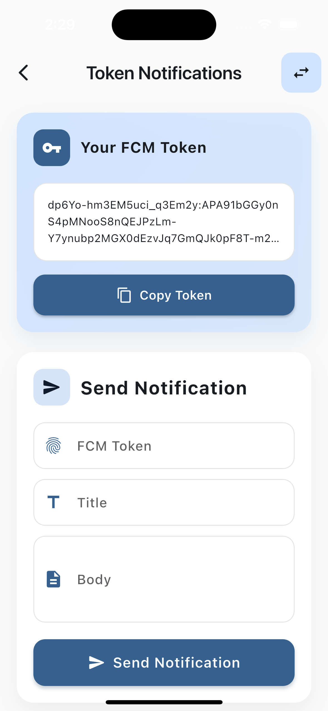
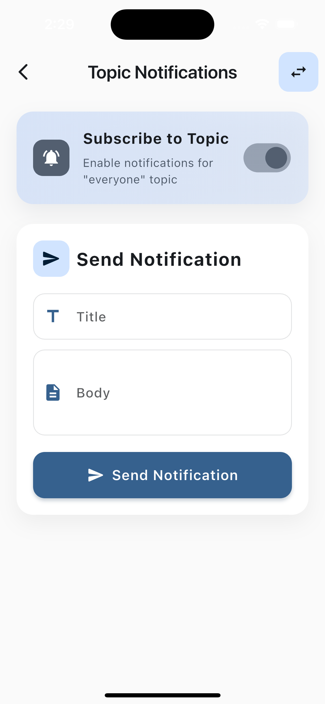
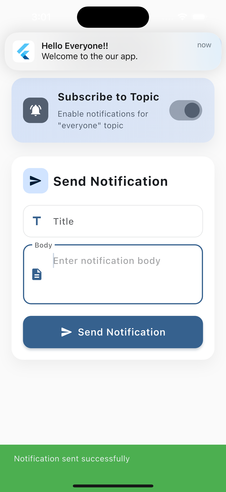
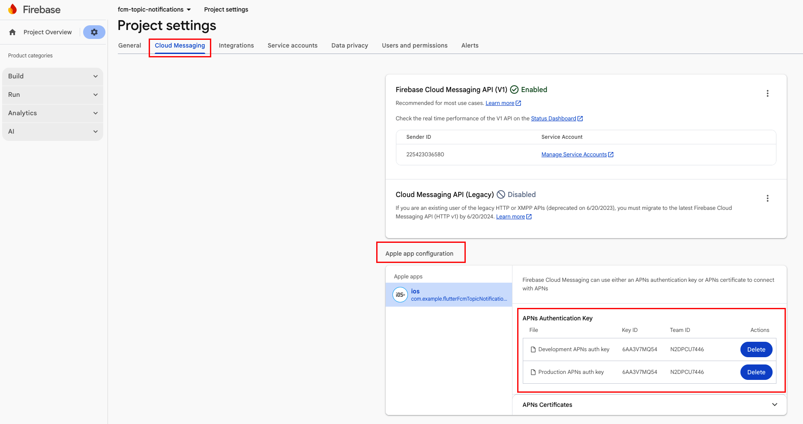
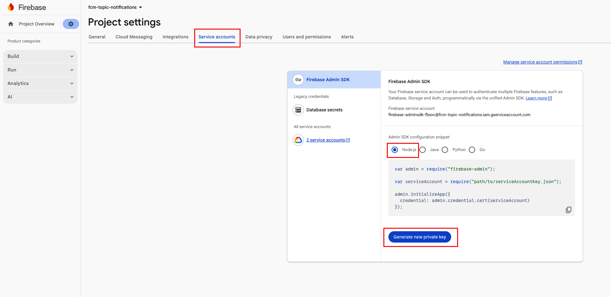

# Flutter FCM Topic Notifications

A comprehensive Flutter application demonstrating Firebase Cloud Messaging (FCM) push notifications using both **token-based** and **topic-based** notification systems. This project includes a Node.js backend server for sending notifications and a Flutter mobile app for receiving them.

## Features

- **Token-based Notifications**: Send notifications to specific devices using their FCM tokens
- **Topic-based Notifications**: Subscribe to topics and send notifications to all subscribed devices
- **Local Notifications**: Display notifications even when the app is in the foreground
- **Cross-platform Support**: Works on both Android and iOS
- **Modern UI**: Clean and intuitive Material Design 3 interface

## Video Tutorial

For a detailed walkthrough in Turkish, check out this video tutorial:

**[Turkish Video Tutorial](https://youtu.be/oETdrD_Vs5A)**

## Screenshots

### Token Notifications Screen

The token notifications screen allows you to:

- View your FCM token
- Copy the token to clipboard
- Send notifications to specific devices using their tokens



### Topic Notifications Screen

The topic notifications screen allows you to:

- Subscribe/unsubscribe to the "everyone" topic
- Send notifications to all subscribed devices



### Success Notification

When a notification is successfully sent, you'll see a confirmation message:



### iOS APNs Configuration

Configure APNs authentication key or certificate in Firebase Console:



### Service Account Configuration

Generate and download the service account key from Firebase Console:



## Prerequisites

Before you begin, ensure you have the following installed:

- **Flutter SDK** (>=3.0.0)
- **Dart SDK** (>=3.0.0)
- **Node.js** (>=14.0.0) and **npm**
- **Firebase Account** with a project created
- **Android Studio** (for Android development)
- **Xcode** (for iOS development, macOS only)
- **CocoaPods** (for iOS dependencies)

## Firebase Setup

### Step 1: Create a Firebase Project

1. Go to [Firebase Console](https://console.firebase.google.com/)
2. Click "Add project" and follow the setup wizard
3. Enable **Google Analytics** (optional but recommended)

### Step 2: Add Android App

1. In Firebase Console, click the Android icon to add an Android app
2. Enter your package name: `com.example.flutter_fcm_topic_notifications`
3. Download the `google-services.json` file
4. Place it in: `flutter_app/android/app/google-services.json`

   > **Note**: Make sure the file is placed in the correct location: `flutter_app/android/app/google-services.json`

### Step 3: Add iOS App

1. In Firebase Console, click the iOS icon to add an iOS app
2. Enter your bundle ID: `com.example.flutterFcmTopicNotifications`
3. Download the `GoogleService-Info.plist` file
4. Place it in: `flutter_app/ios/Runner/GoogleService-Info.plist`
5. Open `flutter_app/ios/Runner.xcworkspace` in Xcode
6. Right-click on `Runner` folder → "Add Files to Runner"
7. Select `GoogleService-Info.plist` and ensure "Copy items if needed" is checked

### Step 4: Configure APNs (iOS Only)

For iOS push notifications to work, you need to configure Apple Push Notification service (APNs):

1. Go to Firebase Console → Project Settings → Cloud Messaging
2. Scroll down to **Apple app configuration**
3. Upload your APNs Authentication Key or Certificate

**Option A: APNs Authentication Key (Recommended)**

- Go to [Apple Developer Portal](https://developer.apple.com/account/resources/authkeys/list)
- Create a new key with "Apple Push Notifications service (APNs)" enabled
- Download the `.p8` key file
- Upload it to Firebase Console with your Key ID and Team ID

**Option B: APNs Certificate**

- Generate an APNs certificate from Apple Developer Portal
- Upload it to Firebase Console

### Step 5: Get Service Account Key

1. Go to Firebase Console → Project Settings → Service Accounts
2. Click **"Generate new private key"**
3. Download the JSON file
4. Save it as `backend/serviceAccountKey.json`

**Important**: Never commit `serviceAccountKey.json` to version control. Add it to `.gitignore`.

## Configuration Files

The following files need to be added or configured:

### Required Files to Add:

1. **`flutter_app/android/app/google-services.json`**

   - Download from Firebase Console → Project Settings → Your apps → Android app
   - Place in: `flutter_app/android/app/`

2. **`flutter_app/ios/Runner/GoogleService-Info.plist`**

   - Download from Firebase Console → Project Settings → Your apps → iOS app
   - Place in: `flutter_app/ios/Runner/`
   - Add to Xcode project (see Step 3 above)

3. **`backend/serviceAccountKey.json`**
   - Download from Firebase Console → Project Settings → Service Accounts
   - Place in: `backend/`
   - Keep this file secure and never commit it

### Files Already Configured:

- `flutter_app/android/app/build.gradle.kts` - Google Services plugin configured
- `flutter_app/android/build.gradle.kts` - Firebase dependencies configured
- `flutter_app/pubspec.yaml` - Firebase packages included
- `backend/index.js` - Express server with FCM endpoints

## Getting Started

### Backend Setup

1. Navigate to the backend directory:

   ```bash
   cd backend
   ```

2. Install dependencies:

   ```bash
   npm install
   ```

3. Make sure `serviceAccountKey.json` is in the `backend` directory

4. Start the server:

   ```bash
   npm start
   ```

   Or for development with auto-reload:

   ```bash
   npm run dev
   ```

   The server will run on `http://localhost:3000`

### Flutter App Setup

1. Navigate to the Flutter app directory:

   ```bash
   cd flutter_app
   ```

2. Install dependencies:

   ```bash
   flutter pub get
   ```

3. For iOS, install CocoaPods dependencies:

   ```bash
   cd ios
   pod install
   cd ..
   ```

4. Update the API base URL in `lib/services/api_service.dart`:

   ```dart
   // For Android Emulator, use your local IP (e.g., 192.168.1.8:3000)
   // Find your IP: Windows (ipconfig), macOS/Linux (ifconfig)
   static const String baseUrl = 'http://YOUR_LOCAL_IP:3000';
   ```

5. Run the app:
   ```bash
   flutter run
   ```

## API Endpoints

The backend provides two main endpoints for sending notifications:

### 1. Send Topic Notification

**Endpoint:** `POST /api/topic/notify`

**Request Body:**

```json
{
  "title": "Hello Everyone!",
  "body": "This is a topic notification"
}
```

**Response:**

```json
{
  "success": true,
  "messageId": "projects/.../messages/...",
  "message": "Notification sent successfully"
}
```

**cURL Example:**

```bash
curl -X POST http://localhost:3000/api/topic/notify \
  -H "Content-Type: application/json" \
  -d '{
    "title": "Hello Everyone!",
    "body": "Welcome to our app"
  }'
```

### 2. Send Token Notification

**Endpoint:** `POST /api/token/notify`

**Request Body:**

```json
{
  "token": "YOUR_FCM_TOKEN",
  "title": "Hello!",
  "body": "This is a token notification"
}
```

**Response:**

```json
{
  "success": true,
  "messageId": "projects/.../messages/...",
  "message": "Notification sent successfully"
}
```

**cURL Example:**

```bash
curl -X POST http://localhost:3000/api/token/notify \
  -H "Content-Type: application/json" \
  -d '{
    "token": "dp6Yo-hm3EM5uci_q3Em2y:APA91b...",
    "title": "Hello!",
    "body": "This is a personal notification"
  }'
```

### Health Check

**Endpoint:** `GET /health`

**Response:**

```json
{
  "status": "ok",
  "timestamp": "2024-01-01T12:00:00.000Z"
}
```

## Project Structure

```
flutter-fcm-topic-notifications/
├── backend/
│   ├── index.js                 # Express server with FCM endpoints
│   ├── package.json             # Backend dependencies
│   ├── serviceAccountKey.json   # Firebase service account (not in repo)
│   └── README.md                # Backend-specific documentation
│
├── flutter_app/
│   ├── lib/
│   │   ├── main.dart            # App entry point
│   │   ├── pages/
│   │   │   ├── token_notification_page.dart
│   │   │   └── topic_notification_page.dart
│   │   └── services/
│   │       ├── api_service.dart              # HTTP client for backend
│   │       ├── firebase_messaging_service.dart # FCM service
│   │       ├── local_notifications_service.dart # Local notifications
│   │       └── shared_preferences_helper.dart   # Storage helper
│   ├── android/
│   │   └── app/
│   │       └── google-services.json          # Add this file
│   ├── ios/
│   │   └── Runner/
│   │       └── GoogleService-Info.plist      # Add this file
│   └── pubspec.yaml             # Flutter dependencies
│
└── README.md                    # This file
```

## Troubleshooting

### Android Issues

**Problem:** Notifications not received on Android

- Ensure `google-services.json` is in `android/app/`
- Check that `com.google.gms.google-services` plugin is applied in `build.gradle.kts`
- Verify internet permission in `AndroidManifest.xml`
- Check that the app has notification permissions enabled

**Problem:** Build errors related to Google Services

- Ensure you've added `google-services.json` to the correct location
- Run `flutter clean` and `flutter pub get`
- Invalidate caches in Android Studio: File → Invalidate Caches

### iOS Issues

**Problem:** Notifications not received on iOS

- Ensure `GoogleService-Info.plist` is added to Xcode project
- Verify APNs configuration in Firebase Console
- Check that Push Notifications capability is enabled in Xcode
- Ensure you're testing on a real device (simulator has limitations)

**Problem:** Build errors in Xcode

- Run `cd ios && pod install && cd ..`
- Clean build folder: Product → Clean Build Folder (Shift+Cmd+K)
- Check that deployment target is iOS 10.0 or higher

### Backend Issues

**Problem:** "Error initializing Firebase Admin"

- Ensure `serviceAccountKey.json` exists in `backend/` directory
- Verify the JSON file is valid and not corrupted
- Check that the service account has proper permissions

**Problem:** "Invalid registration token" error

- Ensure the FCM token is valid and not expired
- Verify the token matches the Firebase project
- Check that the app is properly configured with Firebase

### Network Issues

**Problem:** Cannot connect to backend server

- Ensure backend is running on port 3000
- Update `baseUrl` in `api_service.dart` with your local IP address
- For Android emulator, use `10.0.2.2:3000` instead of `localhost`
- Check firewall settings
- Ensure both devices are on the same network

## Additional Resources

- [Firebase Cloud Messaging Documentation](https://firebase.google.com/docs/cloud-messaging)
- [Flutter Firebase Setup](https://firebase.flutter.dev/)
- [FCM HTTP v1 API](https://firebase.google.com/docs/cloud-messaging/migrate-v1)
- [Apple Push Notifications](https://developer.apple.com/notifications/)

## License

This project is licensed under the MIT License - see the [LICENSE](LICENSE) file for details.

## Contributing

Contributions, issues, and feature requests are welcome! Feel free to check the issues page.

## Security Notes

- **Never commit** `serviceAccountKey.json` to version control
- **Never commit** `google-services.json` or `GoogleService-Info.plist` if they contain sensitive data
- Use environment variables for production deployments
- Rotate service account keys regularly
- Keep Firebase project credentials secure
